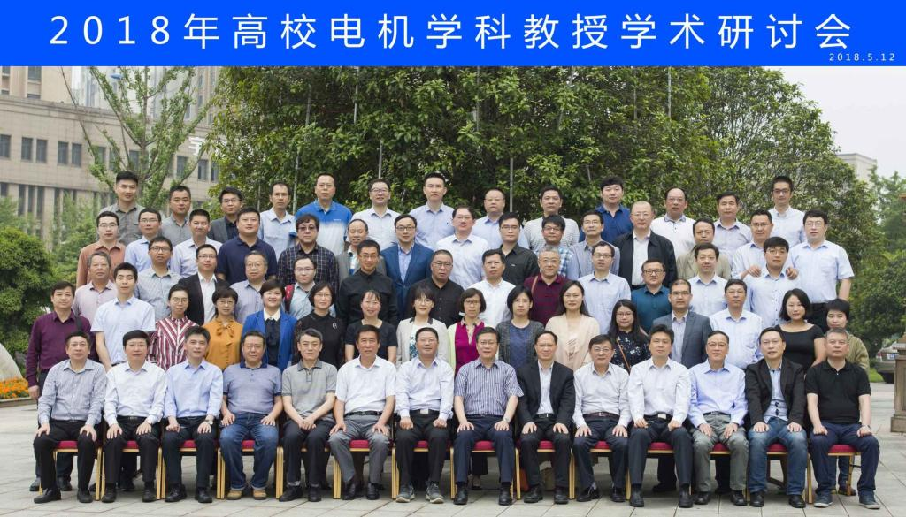

<!---->

The **ReLER** (Recognition, Learning, Reasoning) Lab, directed by [Prof. Yi Yang](https://www.uts.edu.au/staff/yi.yang), is committed to enable machines to
accurately recognize the environment, adaptively understand the human interactions, and
autonomously analyze the behavior through reasoning. To this end, we work on computer
vision, learning algorithms, natural language, and their intersections. Concretely, we aim at
developing novel methods for object, face, action, and event recognition, localizing the
positions, segmenting the instances in images and videos. Additionally, we also study model
acceleration algorithms to speed up the recognition process.

In the real-world scenarios, data
hungry methods can probably fail due to fewer labeled data. We study weakly supervised
learning, unsupervised learning, zero-shot learning, few-shot learning to adapt the model in
this circumstance. Besides recognition, it is also essential for the machines to understand
natural language instructions and queries, as well as communicate with humans fluently.
We develop captioning, question answering, dialog systems for better visual understanding
and reasoning. For more sophisticated human language comprehension, we target at
knowledge extraction, relation mapping, structural graph reasoning.

Our ReLER Lab actively
collaborates with the industry partners to build effective systems and make impacts in real-
world.

### **Lab News**

  
    
    

    

        <a href="{{ site.baseurl }}{{ post.url }}">- {{ post.title }}</a> (<small>{{post.date | date: "%m/%d/%y" }}</small>)
        

    

    
  

 

### Visiting Us
ReLER Lab,
Level 10, Building 11,
[81 Broadway, University of Technology Sydney](https://www.google.com/maps/place/UTS+Faculty+of+Engineering+and+IT/@-33.8840299,151.199234,15z/data=!4m5!3m4!1s0x0:0x5aa7383337c73213!8m2!3d-33.8840299!4d151.199234),
Ultimo, Sydney

<!--Our research focus is to enable machines to accurately recognize the environment, adaptively understand the human interactions, and autonomously analyze the behavior through reasoning. To that end, we work on computer vision, learning algorithms, natural language, and their intersections.-->

<!--To achieve our goals, we will develop novel methods for object, face, action, and event recognition, localize the positions, segment the instances in images and videos. We also study model acceleration algorithms to speed up the recognition process. In real-world scenarios, data hungry methods can probably fail due to fewer labeled data. We study weakly supervised learning, unsupervised learning, zero-shot learning, few-shot learning to adapt the model in this circumstance. Besides recognition, it is also essential for the machines to understand natural language instructions and queries, as well as communicate with humans fluently. We develop captioning, question answering, dialog systems for better visual understanding and reasoning. For more sophisticated human language comprehension, we target at knowledge extraction, relation mapping, structural graph reasoning.-->

<!--Making sense of data is possibly the biggest problem in Neuroscience and beyond. We build algorithms to analyze data. We also use theory as well as computational and [neural modeling](https://en.wikipedia.org/wiki/Computational_neuroscience) to understand how information is processed in the nervous system, explaining data obtained in collaboration with [electrophysiologists](https://en.wikipedia.org/wiki/Electrophysiology) and in [psychophysical](https://en.wikipedia.org/wiki/Psychophysics) experiments. Lastly, we constrain and develop new technologies aimed at obtaining data about brains.-->

<!--Our conceptual work addresses information processing in the nervous system from two angles: (1) By analyzing and explaining electrophysiological data, we study what neurons do. (2) By analyzing and explaining human behavior, we study what all these neurons do together. Much of our work looks at these questions from a normative or causal viewpoint, asking what problems the nervous system should be solving. This often means taking a Bayesian approach. Bayesian decision theory is the systematic way of calculating how the nervous system may make good decisions in the presence of uncertainty. Causal inference from observational data promises to be a key enabler for progress in science.-->

<!--We've pursued projects that involve handshake greetings, human movement, [cell-phone related parkinson's research](http://journal.frontiersin.org/article/10.3389/fneur.2012.00158/abstract), competitions at [Kaggle](https://www.kaggle.com/), [meta-science analysis](http://www.nature.com/nature/journal/v489/n7415/full/489201a.html), data sharing initiatives, and [recording from all neurons in a mouse](http://journals.plos.org/ploscompbiol/article?id=10.1371/journal.pcbi.1002291).-->

<!--Our research group is remarkably interdisciplinary. Our interests span statistics, physics, biology, applied mathematics, molecular biology, metascience, cognitive science, and many other disciplines. Visit our [people page](http://kordinglab.com/people/) to see more information on each person who works in the lab (publications, contact information, photos).-->

<!--For PDFs of our work, visit our [publications page](http://kordinglab.com/publication/). Feel free to [issue on Github](https://github.com/KordingLab/KordingLab.github.io/issues) if links don't work or are obsolete.-->

<!--Here are some cool people in fields that interest us. **note:** This list is in no way complete. We have a lot of collaborators -- if you've collaborated with us and want a link here, let us know!-->

<!--**University of Pennsylvania:**-->
<!--- [David Issadore - Dept of Bioengineering](http://cnt.upenn.edu/david-issadore)-->
<!--- [Jay Gottfried - Dept of Neurology](http://labs.feinberg.northwestern.edu/gottfried/)-->
<!--- [Raquel and Ruben Gur - Dept of Neuropsychiatry](http://www.med.upenn.edu/bbl/faculty-regur.html)-->
<!--- [Maria Geffen - Dept of Otorhinolaryngology](https://geffenlab.weebly.com/)-->
<!--- [Yale Cohen - Dept of Otorhinolaryngology](http://auditoryresearchlaboratory.weebly.com/)-->
<!--- [Dani Bassett - Dept of Bionengineering](https://www.danisbassett.com/)-->
<!--- [Andrew Tsourkas - Dept of Bioengineering](http://www.seas.upenn.edu/~atsourk/)-->
<!--- [Jason Moore - Dept of Biostatistics](https://www.med.upenn.edu/apps/faculty/index.php/g275/p8803452)-->
<!--- [Lyle Ungar - Dept of CIS](http://www.cis.upenn.edu/~ungar/)-->

<!--**Northwestern University:**-->
<!--- [Lee Miller - Depts of Physiology and BME](http://physio.northwestern.edu/)-->
<!--- [Mark Segraves - Depts of Neurobiology and Physiology](http://www.neurobiology.northwestern.edu/people/core-faculty/mark-segraves.html)-->
<!--- [Matt Tresch - Depts of Physiology and BME](http://www.mccormick.northwestern.edu/biomedical/)-->
<!--- [David Mohr - Dept of Preventive medicine](http://www.feinberg.northwestern.edu/faculty-profiles/az/profile.html?xid=17234)-->

<!--**External:**-->

<!--- [Scott Grafton - UCSB](https://www.psych.ucsb.edu/people/faculty/grafton)-->
<!--- [Nicho Hatsopoulos - University of Chicago](http://pondside.uchicago.edu/oba/faculty/Hatsopoulos/lab/)-->
<!--- [Peter Strick - University of Pittsburgh](http://www.cnbc.cmu.edu/faculty/strick-peter-l/view-details)-->
<!--- [Mriganka Sur - MIT](http://surlab.mit.edu/)-->
<!--- [Rob Turner - University of Pittsburgh](http://www.neurobio.pitt.edu/faculty/turner.htm)-->

